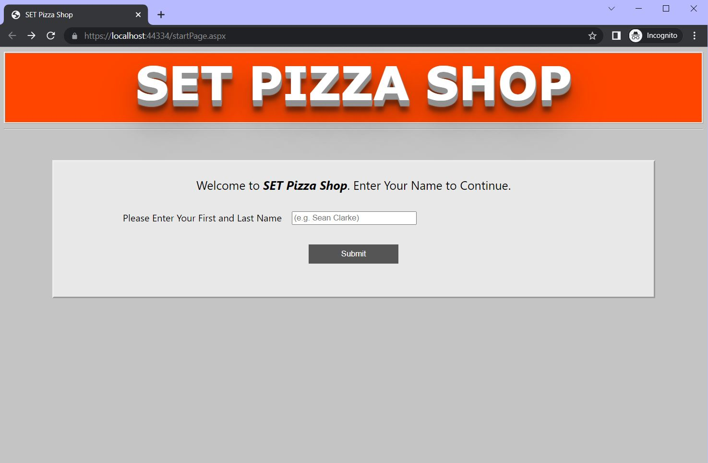
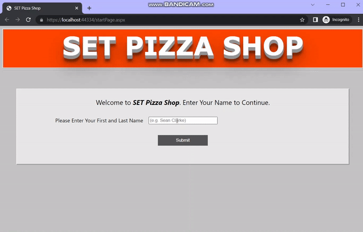
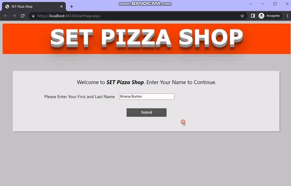
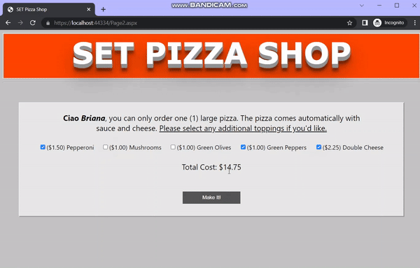

<!-- PROJECT LOGO -->
 

<h3 align="center">SET Pizza Shop</h3>

  

    Pizza topping customizer built in ASP.NET using jQuery, JSON, AJAX, C#, and HTML/CSS
     
     
     
  

<!-- TABLE OF CONTENTS -->

  
Table of Contents

  <ol>
    <li>
      <a href="#about-the-project">About The Project</a>
      <ul>
        <li><a href="#built-with">Built With</a></li>
      </ul>
    </li>
    <li>
      <a href="#getting-started">Getting Started</a>
    </li>
    <li><a href="#usage">Usage</a></li>
    <li><a href="#contact">Contact</a></li>
    <li><a href="#acknowledgments">Acknowledgments</a></li>
  </ol>

<!-- ABOUT THE PROJECT -->
## About The Project

 

This project is a mock pizza store with a pizza topping customizer built in ASP.NET using C#, JSON, jQuery, AJAX, and HTML/CSS. It contains a live pizza topping price calculator that updates the price whenever a topping is selected or unselected (this was done using jQuery & AJAX). The SET Pizza Shop will first prompt the user for their name, with live error checking and feedback to the user if they leave the textbox blank, or type invalid symbols such as numbers. The program also allows the user to review the pizza and toppings they have selected before confirming the pizza order or cancelling it.

(<a href="#readme-top">back to top</a>)

### Built With

* [![ASP dot NET][ASP.NET]][ASP.NET-url]
* [![CSharp][C-sharp]][Csharp-url]
* [![Asynchronous JavaScript and XML][AJAX]][AJAX-url]
* [![jjSON][JSON]][JSON-url]
* [![jjQuery][jQuery]][jQuery-url]
* [![hyper][HTML5]][HTML5-url]
* [![stylesheets][CSS3]][CSS3-url]

(<a href="#readme-top">back to top</a>)

<!-- GETTING STARTED -->
## Getting Started

To setup this program all you will need is Visual Studio and support for C# and ASP.NET. 

(<a href="#readme-top">back to top</a>)

<!-- USAGE EXAMPLES -->
## Usage

This program supports the ability for the user to enter their name and be prompted to select the pizza toppings of their choice, along with the option to confirm the pizza order or cancel the pizza order.

 

Example of the RegularExpressionValidator and RequiredFieldValidator being used when the user types invalid symbols for their name such as numbers, or uses blank or white space for their name. The user will be able to continue if they type their name using alpha characters.

 

Example of user selecting their pizza toppings and having the price be updated live when toppings are selected or unselected. This is done by using the onchange event on the CheckBox which calls the corresponding JavaScript function that makes an AJAX call sending the price information to a back-end C# funtion which calculates and returns the updated price back to the JavaScript function to be updated on screen.

 

Example of the user being prompted to confirm or cancel their pizza order. The screen displays the total price of the pizza along with the toppings the user has selected. Both cancelled and confirmed pages are on Page4.aspx, but the visual of the order being confirmed or cancelled changes depending on the choice of the user (session variable value).

(<a href="#readme-top">back to top</a>)

<!-- CONTACT -->
## Contact

Briana Burton - [in/briana-burton/](https://www.linkedin.com/in/briana-burton/) - brianareburton@gmail.com

Project Link: [https://github.com/bburton0334/set_pizza_shop](https://github.com/bburton0334/set_pizza_shop)

(<a href="#readme-top">back to top</a>)

<!-- ACKNOWLEDGMENTS -->
## Acknowledgments

* I am not responsible for someone maliciously copying this source code with the intent of submitting it as their own for an assignment.

(<a href="#readme-top">back to top</a>)

<!-- MARKDOWN LINKS & IMAGES -->
[ASP.NET]: https://img.shields.io/badge/asp.net-000000?style=for-the-badge&logo=.net&logoColor=white
[ASP.NET-url]: https://dotnet.microsoft.com/en-us/apps/aspnet
[C-sharp]: https://img.shields.io/badge/C%23-000000?style=for-the-badge&logo=csharp&logoColor=white
[Csharp-url]: https://docs.microsoft.com/en-us/dotnet/csharp/
[JSON]: https://img.shields.io/badge/json-000000?style=for-the-badge&logo=json&logoColor=white
[JSON-url]: https://www.json.org/json-en.html
[jQuery]: https://img.shields.io/badge/jquery-000000?style=for-the-badge&logo=jquery&logoColor=white
[jQuery-url]: https://jquery.com/
[HTML5]: https://img.shields.io/badge/html5-000000?style=for-the-badge&logo=html5&logoColor=white
[HTML5-url]: https://developer.mozilla.org/en-US/docs/Glossary/HTML5
[CSS3]: https://img.shields.io/badge/css3-000000?style=for-the-badge&logo=css3&logoColor=white
[CSS3-url]: https://developer.mozilla.org/en-US/docs/Web/CSS
[AJAX]: https://img.shields.io/badge/ajax-000000?style=for-the-badge&logo=ajax&logoColor=white
[AJAX-url]: https://developer.mozilla.org/en-US/docs/Web/Guide/AJAX

